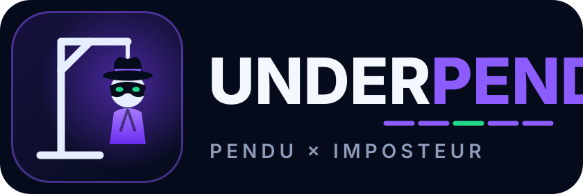

<p align="center"></p>

# UnderPendu — Pendu Multijoueur (Classique + Imposteur)

> Identite visuelle et apercu de tous les ecrans : [docs/presentation.png](docs/presentation.png) (version web : `docs/presentation.html`)

Une version en ligne du jeu du Pendu, jouable a plusieurs (jusqu'a 6 joueurs) depuis n'importe quel navigateur — PC, tablette ou telephone — avec comptes utilisateurs, chat en temps reel, et deux modes de jeu.

Projet realise par Mel, en extension du projet Pendu original (version terminal Python), dans le cadre de l'apprentissage du developpement web, des WebSockets et du deploiement en ligne.

## Modes de jeu

### Classique (cooperatif)
Tous les joueurs devinent le meme mot ensemble, a tour de role. Chacun propose une lettre quand c'est son tour.

**Classement par contribution** : plutot qu'une simple victoire/defaite d'equipe, chaque joueur est classe selon son nombre de **bonnes lettres proposees**. Celui qui a le plus contribue a trouver le mot est designe "gagnant" de la manche, et les points s'accumulent sur l'ensemble du match.

### Imposteur
- 3 a 6 joueurs
- Un mot secret est choisi. **Les innocents connaissent le mot**, mais **1 ou 2 imposteurs** (selon le nombre de joueurs) **ne le connaissent pas**
- Tout le monde voit **le meme indice** (Info de la manche) : l'imposteur connait le theme, mais pas le mot
- A tour de role, chacun propose une lettre — les innocents proposent normalement les vraies lettres, l'imposteur doit bluffer a partir de l'indice sans se faire reperer
- Une fois le mot trouve (ou les erreurs/le temps maximum atteints), **phase de vote** : chaque joueur designe qui il pense etre l'imposteur
- Les innocents gagnent s'ils designent correctement un imposteur reel ; sinon, l'imposteur gagne
- Les roles sont attribues **automatiquement et aleatoirement** a chaque debut de manche (pas de choix manuel, pour garder l'effet de surprise)

## Systeme de manches et de match

L'hote choisit, avant de lancer la partie, **le nombre de manches** du match (1 a 10). A la fin de chaque manche, un ecran recapitulatif s'affiche avec le classement et les points gagnes ; l'hote peut enchainer sur la manche suivante. Apres la derniere manche, un ecran de fin de match affiche le classement final, et l'hote peut **rejouer avec les memes parametres** ou **changer les parametres** (mode, categorie, difficulte, nombre de manches) avant de relancer.

## Fonctionnalites

- Comptes utilisateurs (inscription/connexion), mots de passe hashes avec bcrypt
- Validation des identifiants (3-20 caracteres : lettres, chiffres, underscore)
- Creation de salle avec code a 5 caracteres, jusqu'a 6 joueurs
- Jeu en temps reel via WebSockets, avec chat textuel entre joueurs
- 5 categories de mots (informatique, cybersecurite, animaux, geographie, sports), 3 niveaux de difficulte
- **Minuteur de manche en temps reel** (3 minutes par defaut), avec barre de progression visuelle
- **Minuteur par tour** (20 secondes) : un joueur trop lent voit son tour automatiquement saute
- **Reconnexion** : un rafraichissement de page ou une coupure reseau breve (20 secondes de delai de grace) ne fait plus perdre sa place dans la salle
- **Depart propre** : le bouton ✕ retire immediatement le joueur ; si c'est l'hote, la salle est fermee et tout le monde revient a l'accueil (si l'hote est seulement deconnecte, les autres sont prevenus du delai avant fermeture)
- **Mot revele en fin de manche** : meme en cas de defaite, tout le monde decouvre le mot (lettres non trouvees en rouge, et rappel sur l'ecran de fin de match)
- **Regles du jeu** accessibles en cliquant sur le nom du jeu dans l'en-tete
- **Code de salle copiable** en un clic pour inviter des amis
- **Jeu au clavier** : on peut taper les lettres directement quand c'est son tour
- **Mot de passe affichable/masquable** a la connexion
- **Profil joueur** : rang qui evolue avec les points (Novice → Detective → Inspecteur → Commissaire → Maitre espion), statistiques, succes a debloquer, historique des scores
- **Avatar personnalisable** (couleur + emoji), visible par les autres joueurs dans les salles
- **Preferences liees au compte** : avatar, langue et reglages sont enregistres en base et retrouves sur n'importe quel appareil (PC, telephone, tablette)
- **Parametres** : changer son mot de passe, se deconnecter, langue, animations, vibration quand c'est son tour (telephone), a propos, aide
- **3 langues** : francais, anglais, espagnol (detection automatique selon le navigateur ; chaque joueur choisit la sienne, meme dans la meme salle). Les mots a deviner et leurs indices restent en francais
- **Accueil anime** : lettres flottantes, mini-pendu de demonstration (desactivable dans les parametres)
- **Adapte au telephone et a la tablette** : colonnes empilees, grandes touches, profil en plein ecran
- Interface jouable au navigateur, sans installation, sur tout appareil

## Structure du projet

```
pendu_multijoueur/
├── main.py                # Point d'entree FastAPI (routes API + WebSocket + logique de manches)
├── database.py             # Configuration SQLAlchemy (SQLite en local, PostgreSQL en prod)
├── models.py                # Modeles Utilisateur, Score et Preferences
├── auth.py                  # Hashage des mots de passe, jetons JWT
├── game_logic.py             # Categories de mots, difficulte, calcul des points par contribution
├── websocket_manager.py       # Gestion des salles, roles, votes, minuteurs, reconnexion
├── requirements.txt
├── render.yaml              # Blueprint Render (service web + base PostgreSQL)
├── .python-version          # Version de Python utilisee par Render
├── .env.example
├── .gitignore
├── docs/
│   ├── presentation.html     # Charte graphique + parcours du joueur en images
│   ├── presentation.png      # La meme planche en une seule image
│   └── captures/             # Captures d'ecran du jeu
└── static/
    ├── logo.svg              # Icone du jeu (aussi utilisee comme favicon)
    ├── logo-horizontal.svg   # Logo complet (icone + nom)
    ├── index.html            # Interface (auth, salle, jeu, historique, ecrans de fin)
    ├── app.js                 # Logique client (WebSocket, minuteurs, classements, profil, parametres)
    ├── i18n.js                # Traductions de l'interface (francais, anglais, espagnol)
    └── style.css
```

## Installation et lancement en local

```bash
cd pendu_multijoueur
pip3 install -r requirements.txt --break-system-packages
cp .env.example .env
# Modifie .env si besoin (SECRET_KEY notamment)
uvicorn main:app --reload
```

Ouvre ensuite `http://localhost:8000` dans ton navigateur.

Pour tester le multijoueur en local, ouvre une deuxieme fenetre de navigateur (ou un navigateur different) avec un deuxieme compte, et rejoins la meme salle avec le code affiche.

## Deploiement sur Render

Le fichier `render.yaml` decrit tout le deploiement (service web + base PostgreSQL + variables d'environnement) :

1. Pousse ce projet sur GitHub
2. Cree un compte sur [render.com](https://render.com) et connecte ton compte GitHub
3. Clique sur **New > Blueprint** et choisis ce depot
4. Render cree automatiquement le service `underpendu`, la base `underpendu-db`, genere un `SECRET_KEY` aleatoire et relie `DATABASE_URL` a la base
5. Chaque `git push` sur `main` redeploie automatiquement le site

A savoir (offre gratuite) : le service se met en veille apres 15 minutes sans visite (premier chargement ensuite d'environ 30 a 50 secondes, parties en cours perdues), et la base PostgreSQL gratuite expire au bout de 30 jours.

Une fois deploye, l'URL fournie par Render est accessible depuis n'importe quel appareil connecte a internet — telephone et tablette inclus, directement dans le navigateur.

## Limites connues (a garder en tete)

- Les salles sont stockees **en memoire** : si le serveur redemarre, toutes les parties en cours sont perdues (les comptes utilisateurs et scores, eux, restent en base de donnees)
- La reconnexion fonctionne si le joueur rejoint la meme salle (meme code) dans les 20 secondes suivant la coupure ; au-dela, sa place est liberee
- La duree de la manche (3 min) et du tour (20 s) sont des constantes dans `websocket_manager.py`, pas encore configurables depuis l'interface

## Ameliorations possibles

- Rendre la duree de manche/tour configurable par l'hote depuis l'interface
- Classement global inter-parties (au-dela de l'historique personnel actuel)
- Listes de mots en anglais et en espagnol (aujourd'hui seule l'interface est traduite)